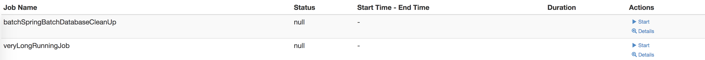

# Spring Batch Support
Use to start/stop batch jobs over web servlet.



## Requirements
- Java: JDK 21
- Spring: Version 6 or higher
- Spring Batch: Version 5 or higher

## Setup
### Add Maven dependency:
```xml
<dependency>
    <groupId>com.namics.oss.spring.support.batch</groupId>
    <artifactId>spring-batch-support</artifactId>
    <version>1.2.1</version>
</dependency>
```

### Configure the required properties
The default settings for servlet-name and servlet-mapping can be overwritten. You could also enable a dark mode.
```properties
com.namics.oss.spring.support.batch.web.servlet-name=springBatch
com.namics.oss.spring.support.batch.web.servlet-mapping=/batch/*
com.namics.oss.spring.support.batch.web.dark-mode=true
```

### Enable cleanup scheduled method
With the following properties the clean up of spring batch database tables can be scheduled.

You can configure the days, how long the executions were persisted in the db. Default is 10 days. 
You could also configure the cron expression for scheduling of the cleanup task.

```properties
com.namics.oss.spring.support.batch.clean-up.enabled=true
com.namics.oss.spring.support.batch.clean-up.keep-days=10
com.namics.oss.spring.support.batch.clean-up.cron=0/10 0/1 * 1/1 * ?
```

## include as iframe
The js app will automatically setup CORS-Header for ajax requests, if required parameters are provided on integration.

If you use iframe integration, provide the following params with your src url.

```html
<iframe src="/batch/detail.html#csrf=${_csrf.token}&csrf_header=${_csrf.headerName}" width="100%"></iframe>
```

Param        | Value
-------------|--------------------------------------------------
csrf         | actual token to be send with every request 
csrf_header  | HTTP-Header name to send token with every request